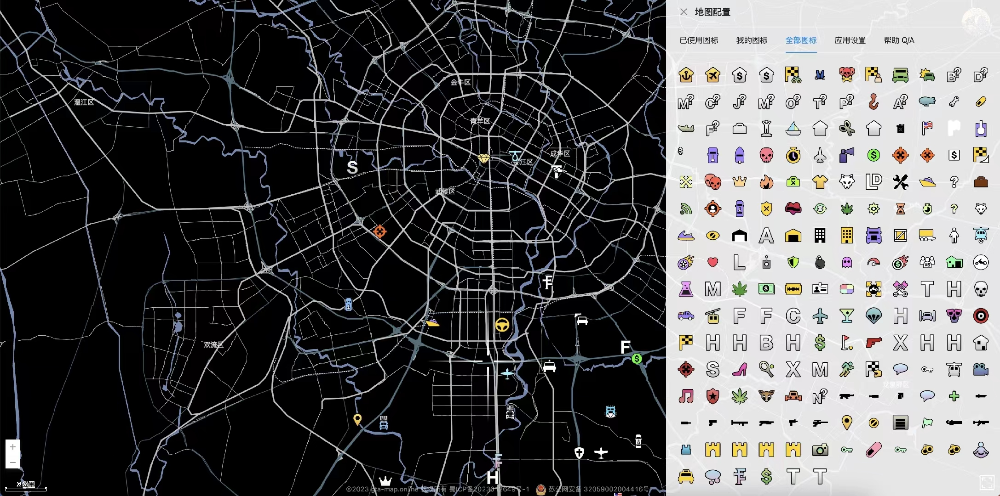
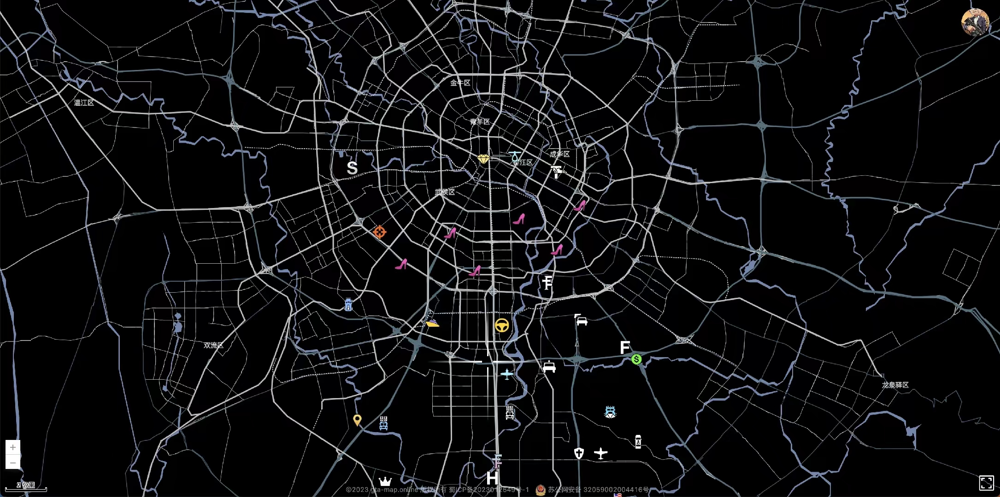
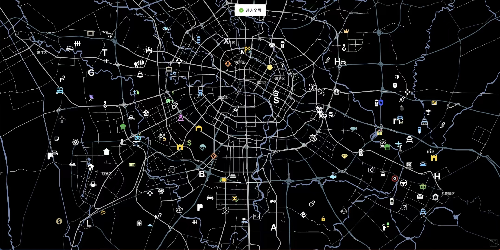

### GTA 风格地图编辑器

主要使用 vue + ts + pinia + antd + indexedDB 编写的 GTA 风格的地图。

您可以去【百度地图开放平台】> 【个性化地图】中，制作更加细节的 GTA 风格地图样式，然后在粘贴进 src/config/baiduMap.ts 中即可。

您也可以替换或者自取里面的图标。

### 效果预览

###### 图标列表.jpg

---

###### 地图展示.jpg

---

###### 全屏.jpg

